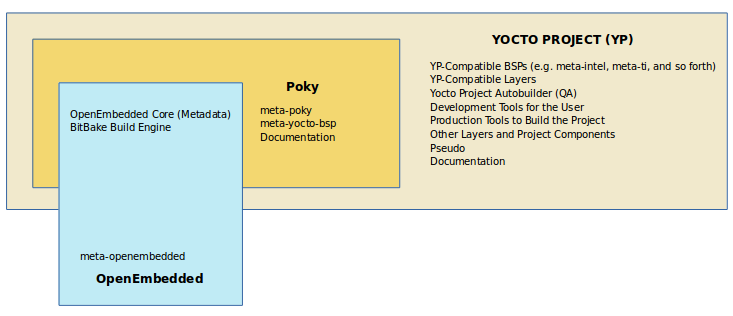

# YOCTO

Resumen de trabajo final de ***Sistema operativo II***. 
Creado por: [Jonathan Cagua](https://github.com/jonathancagua) 

# Tabla de contenidos 💡

- [Requisitos](#requisitos)
- [Conceptos](#conceptos)
- [Instalación](#instalación)
- [Configuración](#configuración)
- [Bitbake](#bitbake)
- [Qemu](#qemu)

# Requisitos
- 50 Gbytes de espacio libre en disco

- Que ejecute una distribución de Linux compatible (es decir, versiones recientes de Fedora, openSUSE, CentOS, Debian o Ubuntu). 

-  
	Git 1.8.3.1 o superior

	tar 1.27 o superior

	Python 3.4.0 o superior

Los paquetes y la instalación de los mismos varían en función de su sistema de desarrollo.

(*) Instala los paquetes necesarios para que Yocto funcione desde
        https://www.yoctoproject.org/docs/latest/ref-manual/ref-manual.html#ubuntu-packages

Ejecutar en consola el siguiente comando:

    $ sudo apt-get install gawk wget git-core diffstat unzip texinfo gcc-multilib build-essential chrpath socat cpio python3 python3-pip python3-pexpect xz-utils debianutils iputils-ping python3-git python3-jinja2 libegl1-mesa libsdl1.2-dev pylint3 xterm zstd liblz4-tool

# Conceptos
## Qué es el Proyecto Yocto

Para entender el resultado proporcionado por el Proyecto Yocto, podemos utilizar la analogía de la máquina de computación

    Entrada: Conjunto de datos que describen lo que queremos, es decir, nuestra especificación (Configuración del Kernel, Nombre del Hardware, Paquetes/Binarios a instalar)

    Salida: Producto embebido basado en Linux (Kernel Linux, Sistema de Archivos Raíz, Bootloader, Árbol de Dispositivos, Toolchain)

## Poky

Poky es una distribución de referencia de Yocto Project. 

Yocto Project utiliza Poky para construir imágenes (kernel, sistema y software de aplicación) para el hardware objetivo.

A nivel técnico es un repositorio combinado de los componentes
- Bitbake
- OpenEmbedded Core
- meta-yocto-bsp
- Documentación

Nota: Poky no contiene archivos binarios, es un ejemplo de cómo construir tu propia distribución de Linux desde el código fuente.

### ¿Cuál es la diferencia entre poky y Yocto?

La diferencia exacta entre Yocto y Poky es que Yocto se refiere a la organización ( como uno se referiría a 'canonical', la compañía detrás de Ubuntu ), y Poky se refiere a los bits reales descargados ( análogo a 'Ubuntu' )

## Metadata 

Un conjunto de datos que describe y da información sobre otros datos.

Los metadata se refieren a las instrucciones de compilación
Comandos y datos utilizados para indicar qué versiones de software se utilizan
De dónde se obtienen
Cambios o adiciones al propio software ( parches ) que se utilizan para corregir errores o personalizar el software para su uso en una situación particular

Los metadatos son una colección de
- Archivos de configuración (.conf)
- Recetas (.bb y .bbappend)
- Clases (.bbclass)
- Los includes (.inc)

## Proyecto OpenEmbedded

Desde http://www.openembedded.org/wiki/Main_Page

OpenEmbedded ofrece el mejor entorno de compilación cruzada de su clase. Permite a los desarrolladores crear una distribución Linux completa para sistemas embebidos.

### ¿Cuál es la diferencia entre OpenEmbedded y el Proyecto Yocto?

El Proyecto Yocto y OpenEmbedded comparten una colección central de metadatos llamada openembedded-core. 

Sin embargo, las dos organizaciones permanecen separadas, cada una con su propio enfoque

OpenEmbedded proporciona un amplio conjunto de metadatos para una gran variedad de arquitecturas, características y aplicaciones

	No es una distribución de referencia
	Está diseñada para ser la base de otras.

El Proyecto Yocto se centra en proporcionar herramientas, metadatos y paquetes de soporte de placas (BSP) potentes, fáciles de usar, interoperables y bien probados para un conjunto básico de arquitecturas y placas específicas.

### OpenEmbedded-Core(oe-core)

El Proyecto Yocto y OpenEmbedded han acordado trabajar juntos y compartir un conjunto común de metadatos (recetas, clases y archivos asociados): oe-core

## Bitbake

Bitbake es un componente central del Proyecto Yocto.

Básicamente realiza la misma funcionalidad que make.

Es un programador de tareas que analiza el código mixto de python y shell script

El código parseado genera y ejecuta tareas, que son básicamente un conjunto de pasos ordenados según las dependencias del código.

Lee las recetas y las sigue buscando paquetes, construyéndolos e incorporando los resultados en imágenes de arranque.

Hace un seguimiento de todas las tareas que se procesan para asegurar su finalización, maximizando el uso de los recursos de procesamiento para reducir el tiempo de construcción y siendo predecible.

## meta-yocto-bsp

Un Board Support Package (BSP) es una colección de información que define cómo soportar un dispositivo de hardware particular, un conjunto de dispositivos o una plataforma de hardware

El BSP incluye información sobre las características de hardware presentes en el dispositivo y la información de configuración del kernel junto con cualquier controlador de hardware adicional necesario.

El BSP también enumera cualquier componente de software adicional que se requiera, además de una pila de software Linux genérica, tanto para las características esenciales como para las opcionales de la plataforma.

La capa meta-yocto-bsp en Poky mantiene varios BSPs como el Beaglebone, EdgeRouter, y versiones genéricas de máquinas IA de 32 y 64 bits.

### Máquinas soportadas

Texas Instruments BeagleBone (beaglebone)
Freescale MPC8315E-RDB (mpc8315e-rdb)
PCs y dispositivos basados en Intel x86 (genericx86 y genericx86-64)
Ubiquiti Networks EdgeRouter Lite (edgerouter)

Nota: Para desarrollar en un hardware diferente, necesitarás complementar Poky con capas Yocto específicas para el hardware.

## Conclusión

Poky incluye 
- algunos componentes de OE (oe-core)
- bitbake
- demo-BSP's
- scripts de ayuda para configurar el entorno
	emulador QEMU para probar la imagen

# Instalación
## Repositorio poky
Usar la versión 3.4 de yocto con el nombre **Honister**. Clonar el repositorio Poky:

    git clone -b honister git://git.yoctoproject.org/poky poky-honister

Ingresar a la carpeta creada y hacer pull del repositorio para bajar cambios:

    cd poky-honister
    git pull --all --prune

## Capas meta adicionales
Clonar los repositorios dentro de ***poky-honister***:

    git clone -b honister git://git.yoctoproject.org/meta-raspberrypi
    git clone -b honister git://git.openembedded.org/meta-openembedded
    git clone -b honister https://github.com/meta-qt5/meta-qt5.git

# Configuración
Salir de la carpeta **poky-honister** para generar los archivos de compilación fuera de esta carpeta:
 
    cd ..
    source poky-honister/oe-init-build-env build_folder
 
Se crea un nuevo directorio **build_folder**. Dentro de la carpeta se crea un directorio con el nombre de  **conf** con los siguientes archivos:
- bblayers.conf
- local.conf
- templateconf.cfg

## Editando local.conf para simulación con qemu
Cambiar la siguiente línea:

    # This sets the default machine to be qemux86-64 if no other machine is selected:
    MACHINE ??= "qemux86-64"

Seleccionar la maquina para ejecutar yocto con qemu
    
    # This sets the default machine to be qemux86-64 if no other machine is selected:
    MACHINE ??= "qemuarm"
    
## Editando local.conf para raspberry
Cambiar la siguiente línea:

    # This sets the default machine to be qemux86-64 if no other machine is selected:
    MACHINE ??= "qemux86-64"

Dependiendo de la raspberry que se quiera utilizar (raspberrypi0, raspberrypi0w, raspberrypi3, raspberrypi3-64, raspberrypi4, raspberrypi4-64)
    
    # This sets the default machine to be qemux86-64 if no other machine is selected:
    MACHINE ??= "raspberrypi4-64"

Añadir las siguientes líneas al final:

    IMAGE_FSTYPES = "ext4.xz rpi-sdimg"
    SDIMG_ROOTFS_TYPE = "ext4.xz"

# Bitbake
Dentro de la carpeta **build_folder** ejecutar el siguiente comando para construir una imagen minima.

    bitbake core-image-minimal

En la **[documentación de Yocto](https://docs.yoctoproject.org/ref-manual/images.html)**  se encontrará una breve descripción de las descripciones de imágenes disponibles.

Por ejemplo:

 - core-image-minimal: una pequeña imagen capaz de permitir que un dispositivo arranque.
 - core-image-base: una imagen solo para consola totalmente compatible con el hardware del dispositivo de destino.
 - core-image-full-cmdline: una imagen solo para consola con más funciones completas del sistema de Linux instaladas.

Después de unas horas el BitBake termina y el **sdimg** se muestra en el siguiente directorio:

    /build_folder/tmp/deploy/images/qemuarm

    o

    /build_folder/tmp/deploy/images/raspberrypi4-64

# Qemu
Las máquinas basadas en QEMU permiten realizar pruebas y desarrollos sin necesidad de hardware real.

Actualmente se admiten emulaciones para:

        • ARM
        • MIPS
        • MIPS64
        • PowerPC
        • X86
        • X86_64

Poky proporciona un script 'runqemu' que le permitirá iniciar el QEMU utilizando imágenes generadas por yocto.

El script runqemu se ejecuta como:

    runqemu <machine> <zimage> <filesystem>

donde:

- < machine > es la máquina/arquitectura a utilizar (qemuarm/qemumips/qemuppc/qemux86/qemux86-64)

- < zimage > es la ruta de acceso a un núcleo (e.g. zimage-qemuarm.bin)
- < filesystem > es la ruta a una imagen ext2 (e.g. filesystem-qemuarm.ext2) o un directorio nfs

Las instrucciones completas de uso se pueden ver ejecutando el comando sin especificar opciones.

Dentro de la carpeta construdia **build_folder**
ejecutar el siguiente comando:

    $ runqemu qemuarm

## Nographic

Es posible ejecutar QEMU sin la ventana gráfica añadiendo nographic a la línea de comandos

    $ runqemu qemuarm nographic

## Para añadir un paquete concreto en su sistema de archivos raíz.

Abrir su archivo local.conf y añada el nombre de la receta a continuación

    IMAGE_INSTALL += "nombre-receta"

Por ejemplo, 

    IMAGE_INSTALL += "usbutils" para lsusb
o 

    IMAGE_INSTALL_append = " usbutils"

### Exit QEMU

Salir de QEMU haciendo click en el icono de apagado o escribiendo Ctrl-C en la ventana de transcripción de QEMU.

